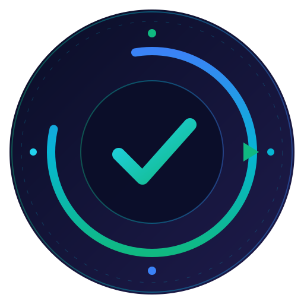

<p align="center">
  
</p>

<p align="center">
  <a href="https://github.com/ruslanmv/SelfRepair-Repo/actions"></a>
  <a href="https://pypi.org/project/selfrepair-repo/"></a>
  <a href="https://www.python.org/"></a>
  <a href="LICENSE"></a>
  <a href="#platforms"></a>
</p>

<p align="center">
  <b>SelfRepair Repo is an open-source AI Secure Delivery Copilot for repository scanning, AI-assisted repair, validation, and audit-ready reporting.</b><br/>
  <sub>Built on a repository-health automation core and upgraded with FastAPI orchestration, secure delivery workflows, and agent-ready endpoints.</sub>
</p>

---

## 🎯 Enterprise Value Proposition

SelfRepair Repo is engineered for organizations that need to ship faster without compromising on security, governance, or audit posture.

- **Accelerated Delivery** — Reduce manual repository configuration and CI troubleshooting by up to **80%** through deterministic auto-repair and policy-driven workflows.
- **Continuous Compliance** — Enforce organization-wide security and architectural standards across every connected repository, automatically and continuously.
- **Audit-Ready Reporting** — Generate SOC 2 / ISO 27001-friendly health reports and tamper-evident audit trails for instant visibility into your software supply chain.
- **Reduced MTTR** — Cut mean time to repair from hours to minutes with AI-assisted, policy-gated fixes that ship as reviewable Pull Requests.
- **Vendor Neutrality** — Multi-platform support (GitHub, GitLab, Hugging Face) and pluggable LLM backends keep you in control of where your code and inference run.

---

## 🛡️ Overview

SelfRepair Repo scans repositories, detects delivery risks, generates repairs with AI assistance, validates fixes, and returns an audit-ready report.

Built on top of the original repository-health engine, it keeps the existing strengths of repository discovery, scanning, healing, sandbox validation, and reporting, while adding a FastAPI backend, multi-agent orchestration, and a vendor-neutral `/v1/rpc` endpoint for agent and tool integration.

---

[](assets/demo.gif)

## ✨ Core Capabilities

| Capability | Description |
|------------|-------------|
| 🔍 **Multi-platform Discovery** | Scan GitHub orgs/users, GitLab groups, and Hugging Face namespaces |
| 🧰 **Automated Repair** | Fix missing Makefiles, pyproject.toml, health tests, and HF metadata |
| 🤖 **LLM-Assisted Healing** | OllaBridge Cloud integration for intelligent repair suggestions |
| 🛡️ **Policy Engine** | Risk assessment and change governance before any modifications |
| 📈 **Health Dashboard** | Static JSON + HTML status site deployed to GitHub Pages |
| 🔄 **Self-Healing Loop** | Iterative verify → fix → verify cycle with configurable retry |
| 🔀 **GitPilot Integration** | AI-assisted code repair through the GitPilot agent |
| 📦 **MatrixLab Sandbox** | Isolated execution environment for safe verification |
| 🌐 **GitLab Support** | Full GitLab API v4 integration (gitlab.com + self-hosted) |
| 🤗 **HuggingFace Support** | Model, dataset, and Space repository management |
| 👁️ **Issue Watch** | Sync, classify, and act on external GitHub / GitLab / HF issues |
| 🔐 **CI Guardian** | Detect, dedupe, and policy-gate CI failures across the fleet |

---

## 🔒 Security & Data Privacy

SelfRepair Repo is designed for **on-premises enterprise environments** where organizations need full control over their code, infrastructure, and data. Security, privacy, and governance are first-class concerns, not afterthoughts.

- **Air-Gapped Capable** — Run entirely on-premise using local LLMs through OllaBridge with **zero external network calls**. Suitable for regulated industries and government deployments.
- **No Data Retention by Design** — Proprietary source code is scanned in isolated MatrixLab sandboxes and is **never used to train external models**. LLM context windows are scoped to each repair and discarded after policy evaluation.
- **Secret Redaction at Source** — A 14-pattern entry-gate redactor (cloud creds, GitHub PATs, GitLab/HF/OpenAI/Anthropic tokens, npm/PyPI tokens, auth headers) plus a Shannon-entropy fallback ensures secrets never leave the repository boundary.
- **Human-in-the-Loop** — All automated repairs are proposed as **Draft Pull Requests / Merge Requests**. No code is merged without explicit human approval; auto-merge is opt-in per policy bundle.
- **RBAC & Governance** — Policy bundles defined in OPA/Rego control which classes of fixes can be applied, by whom, and under what conditions.
- **Sigstore-Attested Commits** — Every automated commit is cryptographically signed and verifiable against the public Sigstore transparency log.
- **Tamper-Evident Audit Log** — Append-only audit trail with monthly partitioning, 30-day hot retention, and SHA-256 chain verification — ready for SOC 2 and ISO 27001 evidence collection.
- **Tenancy-as-a-Row** — Multi-tenant by default. Every record carries an `org_id`; data isolation is enforced at the SQL layer.

---

## 🛠️ Installation & Setup

### What SelfRepair Repo does

1. Clones and inspects a target repository
2. Checks delivery-readiness signals such as `Makefile`, `pyproject.toml`, tests, install, and start flows
3. Classifies delivery, security, and compliance issues
4. Uses AI-assisted repair generation to propose safe fixes
5. Validates the repaired repository in an isolated sandbox
6. Returns an audit-friendly final report for enterprise review

### Installation

```bash
# Clone the repository
git clone https://github.com/ruslanmv/SelfRepair.git
cd SelfRepair

# Create virtual environment and install
python -m venv .venv
source .venv/bin/activate
pip install -e ".[all]"
pip install fastapi uvicorn
```

Or with `uv` (recommended):

```bash
uv sync
```

### Configuration

```bash
cp .env.example .env
# Edit .env with your tokens and settings
```

### Run

```bash
# Start the API backend
uvicorn backend.app.main:app --reload

# Or use the CLI engine
selfrepair-repo discover
selfrepair-repo run
selfrepair-repo check-repo owner/repo-name
selfrepair-repo publish-site
```

---

## 🌍 Open Source Vision

SelfRepair Repo is intended to be a practical, public, and community-driven open-source product for repository quality, delivery readiness, and safe automated repair.

The vision is to make repository maintenance easier for:
- individual developers maintaining side projects
- startup teams that need fast release confidence
- platform teams managing many repositories
- open-source maintainers who need repeatable health checks and repair suggestions

Core principles:
- **Open by default** — normal Git-based workflows, transparent rules, readable reports
- **Safe automation** — validation before and after repair, with auditable changes
- **Vendor-neutral architecture** — usable with common Git platforms, CI systems, and local or hosted AI services
- **Extensible design** — easy to add new analyzers, repair strategies, and policy checks
- **Community contribution** — project rules, templates, and repair strategies should be simple to extend in public


---

## 🔧 Configuration Reference

### Platforms

<details>
<summary><b>🐙 GitHub</b></summary>

```env
GITHUB_TOKEN=ghp_xxxxxxxxxxxx
GITHUB_ORG=my-organization        # or GITHUB_USER=my-username
GITHUB_BASE_BRANCH=main
GITHUB_INCLUDE_PRIVATE=true
```
</details>

<details>
<summary><b>🦊 GitLab</b></summary>

```env
GITLAB_TOKEN=glpat-xxxxxxxxxxxx
GITLAB_URL=https://gitlab.com     # or your self-hosted instance
GITLAB_GROUP=my-group              # or GITLAB_USER=my-username
GITLAB_INCLUDE_PRIVATE=true
```
</details>

<details>
<summary><b>🤗 Hugging Face</b></summary>

```env
HF_TOKEN=hf_xxxxxxxxxxxx
HF_NAMESPACE=my-namespace
HF_REPO_TYPES=model,dataset,space
```
</details>

<details>
<summary><b>🤖 OllaBridge Cloud (LLM Repair)</b></summary>

```env
# Canonical Agent-Matrix names (preferred).
OLLABRIDGE_ENABLED=true
OLLABRIDGE_BASE_URL=https://api.ollabridge.com/v1
OLLABRIDGE_API_KEY=ob_xxxxxxxxxxxxxxxx     # placeholder — never commit a real key
OLLABRIDGE_MODEL=qwen2.5:1.5b
OLLABRIDGE_TIMEOUT=120.0

# OpenAI-compatible aliases (used as fallback when OLLABRIDGE_* are unset).
# matrix-maintainer subprocesses SelfRepair with these injected.
# OPENAI_BASE_URL=https://api.ollabridge.com/v1
# OPENAI_API_KEY=ob_xxxxxxxxxxxxxxxx
# OPENAI_MODEL=qwen2.5:1.5b
```

SelfRepair uses OllaBridge's OpenAI-compatible `/v1/chat/completions` endpoint
for LLM-assisted repair suggestions when automated fixes aren't sufficient.
Precedence is **`OLLABRIDGE_*` > `OPENAI_*` > built-in defaults**, so the same
OpenAI-compatible code paths keep working unmodified regardless of which
naming scheme the caller uses.
</details>

---

## 🏗️ Architecture

```
selfrepair/
├── cli.py                  # Typer CLI entrypoint
├── main.py                 # Orchestration: discover → check → heal → report
├── settings.py             # Pydantic settings from .env
├── models.py               # Core data models (RepoRef, RepoHealthReport, etc.)
│
├── inventory/              # Repository discovery
│   ├── github_discovery.py  # GitHub org/user scanning
│   ├── gitlab_discovery.py  # GitLab group/user scanning
│   └── huggingface_discovery.py
│
├── analyzers/              # Repository analysis
│   └── repo_analyzer.py     # Layout detection & standard checks
│
├── healing/                # Self-healing engine
│   ├── healing_loop.py      # Iterative verify-fix-verify
│   └── fix_strategies.py    # Safe automated repairs
│
├── llm/                    # LLM integration
│   └── ollabridge_client.py # OllaBridge Cloud API client
│
├── gitpilot/               # GitPilot AI agent integration
├── matrixlab/              # Sandbox execution
├── governance/             # Policy engine & risk assessment
├── standards/              # Repository standard rules
├── reporting/              # Status & incident reporting
├── site/                   # Static dashboard generator
└── storage/                # State persistence
```

---

## 🤖 OllaBridge Integration

[OllaBridge Cloud](https://github.com/ruslanmv/ollabridge-cloud) is the
**official enterprise LLM gateway for the Agent-Matrix ecosystem**. SelfRepair,
GitPilot, and matrix-maintainer all route their LLM traffic through it, which
means a single API key, a single audit log, and a single point of policy
enforcement for every Agent-Matrix agent in your organization.

How SelfRepair plugs into the gateway:

1. **Health Check Fails** → SelfRepair detects a broken install/test/start.
2. **LLM Analysis** → Sends failure context to OllaBridge `/v1/chat/completions`.
3. **Smart Suggestions** → Receives repair recommendations from the LLM.
4. **Safe Application** → Applies fixes through the governance policy engine.

### Env-var precedence

SelfRepair is most often invoked as a library or subprocess from
[matrix-maintainer](https://github.com/agent-matrix/matrix-maintainer), which
injects the OllaBridge gateway as the standard OpenAI-compatible
`OPENAI_BASE_URL` / `OPENAI_API_KEY` (`ob_…`) / `OPENAI_MODEL` env vars. To
keep that ergonomic — and to keep the rest of the OpenAI-compatible code
paths intact — SelfRepair honors both naming schemes with a defined order of
precedence:

1. `OLLABRIDGE_BASE_URL` / `OLLABRIDGE_API_KEY` / `OLLABRIDGE_MODEL` (canonical).
2. `OPENAI_BASE_URL` / `OPENAI_API_KEY` / `OPENAI_MODEL` (compat fallback used
   by matrix-maintainer and other orchestrators).
3. Built-in defaults (`https://api.ollabridge.com/v1`, `qwen2.5:1.5b`, …).

```python
# Either of these env shapes works — SelfRepair resolves them the same way.

# (a) Canonical Agent-Matrix names:
OLLABRIDGE_ENABLED=true
OLLABRIDGE_BASE_URL=https://api.ollabridge.com/v1
OLLABRIDGE_API_KEY=ob_xxxxxxxxxxxxxxxx
OLLABRIDGE_MODEL=qwen2.5:1.5b

# (b) OpenAI-compat names (what matrix-maintainer injects when it
#     subprocesses SelfRepair):
OPENAI_BASE_URL=https://api.ollabridge.com/v1
OPENAI_API_KEY=ob_xxxxxxxxxxxxxxxx
OPENAI_MODEL=qwen2.5:1.5b
```

OllaBridge API keys start with the `ob_` prefix; never commit a real key to
the repository — `.env.example` ships placeholders only.

---

## 🌐 Platform Compatibility

| Platform | Discovery | Clone | Repair | PR/MR | Status |
|----------|-----------|-------|--------|-------|--------|
| **GitHub** | ✅ Org + User | ✅ HTTPS | ✅ Full | ✅ Pull Request | Stable |
| **GitLab** | ✅ Group + User | ✅ HTTPS | ✅ Full | 🚧 Merge Request | Beta |
| **Hugging Face** | ✅ Namespace | ✅ HTTPS | ✅ Metadata | 🚧 Discussion | Beta |

---

## 📈 Repair Coverage

| Check | Auto-Fix | Description |
|-------|----------|-------------|
| `makefile` | ✅ | Ensures `install`, `test`, `start` targets exist |
| `pyproject` | ✅ | Creates/updates pyproject.toml with Python 3.11+ |
| `health_test` | ✅ | Generates `tests/test_health.py` |
| `python311` | ✅ | Enforces `requires-python >= 3.11` |
| `uv` | ✅ | Adds `[tool.uv]` section |
| `readme` | ✅ | Validates README and HF front matter |
| **LLM-assisted** | 🤖 | OllaBridge-powered intelligent fixes |

---

## 🚀 Deployment

### GitHub Actions (Recommended)

SelfRepair Repo ships with ready-to-use workflows:

- **`daily-maintenance.yml`** — Runs health checks daily at 05:15 UTC
- **`manual-run.yml`** — On-demand single repo or full fleet check
- **`publish-status-site.yml`** — Deploys dashboard to GitHub Pages

### HuggingFace Spaces

See [`deploy/huggingface/`](deploy/huggingface/) for Docker-based HF Spaces deployment.

### Docker

```bash
docker build -t selfrepair-repo .
docker run --env-file .env -p 8000:8000 selfrepair-repo
docker compose up --build
```

---

## 🧪 Testing

```bash
# Run all tests
pytest

# Unit tests only
pytest tests/unit -q

# With coverage
pytest --cov=selfrepair --cov-report=html
```

---

## 💼 Enterprise Support & Commercial Use

SelfRepair Repo is open-source under Apache-2.0 and free to use commercially. Community support is available through [GitHub Issues](https://github.com/ruslanmv/SelfRepair-Repo/issues) and [Discussions](https://github.com/ruslanmv/SelfRepair-Repo/discussions).

📧 **Contact** [contactus@ruslanmv.com](mailto:contactus@ruslanmv.com)

---

## 📚 Related Projects

| Project | Description |
|---------|-------------|
| [OllaBridge Cloud](https://github.com/ruslanmv/ollabridge-cloud) | Enterprise AI gateway with OpenAI-compatible API |
| [OllaBridge](https://github.com/ruslanmv/ollabridge) | Local AI bridge for Ollama |
| [GitPilot](https://github.com/ruslanmv/gitpilot) | Multi-LLM AI assistant for Git workflows |
| [MatrixLab](https://github.com/agent-matrix/matrixlab) | Sandbox execution environment |

---

## 📄 License

Apache-2.0 © [Ruslan Magana Vsevolodovna](https://github.com/ruslanmv)

For commercial licensing inquiries, custom terms, or third-party integration agreements, please contact [contactus@ruslanmv.com](mailto:contactus@ruslanmv.com).

---

<p align="center">
  <br/>
  <sub><b>SelfRepair Repo</b> — Trusted automation for the modern software supply chain.</sub><br/>
  <sub>Built in the open · Engineered for the enterprise.</sub>
</p>
